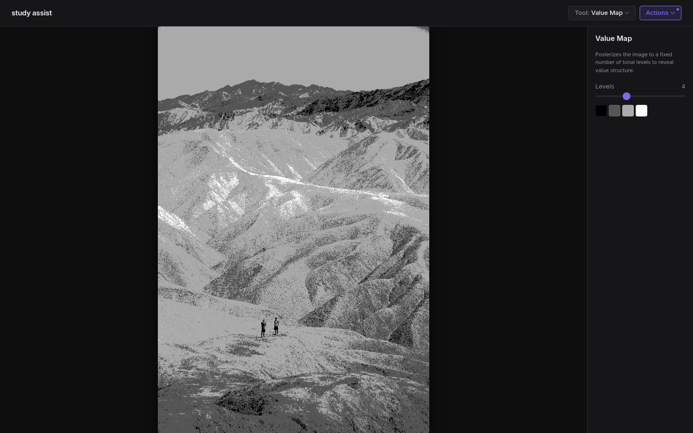

# study assist

<p>
  
  
  
  
  
  
</p>

A painting reference tool for artists — value maps, notan, colour picking, paint mixing, dithering, and more in one place, with a clean dark-mode-first UI.



Process reference photos entirely in your browser. No uploads, no accounts, no server — everything runs locally on your device.

**→ Try it at [thephilip.github.io/study-assist](https://thephilip.github.io/study-assist/)**

---

## Tools

| Tool | Description |
|---|---|
| **Value Map** | Posterizes to N tonal levels to reveal value structure |
| **Notan** | Reduces to pure black and white to study shape and silhouette |
| **Color Picker** | Hover to preview, click to lock; averages a sampled region; copies hex |
| **Shape Simplify** | Box blur + posterize to flatten texture into readable flat shapes |
| **Dither** | Floyd-Steinberg, Atkinson, Bayer 4×4/8×8 — grayscale and colour modes |
| **Grid Overlay** | Configurable grid with presets, opacity, and line-colour controls |
| **Composition** | Rule of thirds, phi grid, corner diagonals, golden spiral, centre crosshair |
| **Sighting** | Angle finder, proportion ratios, and plumb line for measuring your reference |
| **Color Harmonies** | Five HSL-based harmony schemes with optional pigment matching |
| **Palette Extraction** | K-means++ colour clustering with a proportional swatch bar |
| **Temperature Map** | Maps hue to warm/cool overlay while preserving luminance |
| **Paint Mix** | Matches sampled colours to your paint brand; suggests a 2-paint mix ratio (Pro upgrade unlocks alternative mixes and 3-paint combos) |
| **Histogram** | Luma histogram with log/linear scale; min, mean, and max tonal range stats |
| **Edge Detection** | Sobel edge overlay with blur, threshold, and opacity controls |
| **Sketch** | Draw value thumbnails directly over the reference with pressure-sensitive stylus support |
| **ViewCatcher** | Interactive crop overlay with aspect ratio presets; drag to compose and save as new image |
| **Colour Studio** | Unified colour analysis — extract palette swatches, find paint matches, and explore harmonic schemes in one view |
| **Automated Sketch** | Composites Sobel edge linework over simplified colour planes for a hand-drawn sketch look |
| **Gamut Map** | Plots every sampled colour on the LAB a*–b* plane — reveals colour temperature bias, chroma spread, and where your specific paints fall relative to the image |

All processed-canvas tools include a **side-by-side compare mode**, **Save PNG**, and **Use as source** (bake the output as the new working image). A full **undo stack** lets you step back through applied changes.

---

## Paint brand database

Paint Mix includes pigment data for four brands, matched using LAB ΔE colour distance:

| Brand | Tier |
|---|---|
| Gamblin Artists' Oil | Free |
| Winsor & Newton Artists' Oil | Premium |
| Williamsburg Handmade Oil | Premium |
| Rembrandt Artists' Oil | Premium |
| Utrecht Artists' Oil | Premium |
| Geneva Artists' Oil | Premium |

Hex values are sourced from manufacturer swatch cards and handprint.com reference data (D65 illuminant, reference approximations).

---

## Getting started

```bash
pnpm install
pnpm dev
```

Open [http://localhost:5173](http://localhost:5173), drop in a reference photo, and start studying.

```bash
# Production build
pnpm build
```

---

## PWA install

You can install Study Assist as a standalone app on any device:

- **Desktop (Chrome/Edge/Samsung):** click the install icon in the address bar or the "Install Study Assist" button in the app header
- **iOS Safari:** tap the Share button → **Add to Home Screen**
- **Android Chrome:** tap the menu → **Add to Home Screen** (or the install banner)

Once installed, it launches full-screen with offline support and automatic update notifications.

---

## Tech stack

- **Vite 8 + React 19 + TypeScript** (strict mode)
- **CSS Modules** + CSS custom properties — design tokens in `src/tokens/index.css`
- **Canvas API** + `getImageData` pixel manipulation — no image processing libraries
- **Web Workers** for heavy algorithms (K-means palette extraction, gamut density analysis)
- **PWA** — installable, offline-capable, update notifications via service worker
- **No backend** — all processing is client-side; no data ever leaves the device

---

## Project structure

```
src/
  components/       # Panel, Slider, ImageDrop, CanvasWrap, Welcome
  hooks/            # useImage (with undo stack), useCompare
  lib/
    canvas.ts       # getPixelData, putPixelData, mapPixels, drawImageToCanvas
    color.ts        # RGB ↔ HSL ↔ LAB ↔ CMYK conversions + deltaE
    changelog.ts    # Versioned release notes (shown post-update)
    entitlements.ts # Brand pack unlock state (localStorage)
    pigments/       # Paint brand database + LAB nearest-neighbour matching
  tokens/
    index.css       # All design tokens (colour, type, spacing, radii, shadows)
  tools/            # One .ts (logic) + .tsx (component) per tool
  workers/
    kmeans.worker.ts
    gamut.worker.ts
```

---

## Roadmap

- [ ] Native tablet app — iOS + Android (Flutter, post web release)
- [ ] Spectral-measured pigment data for improved mix accuracy

---

## License

MIT — see [LICENSE](LICENSE)
