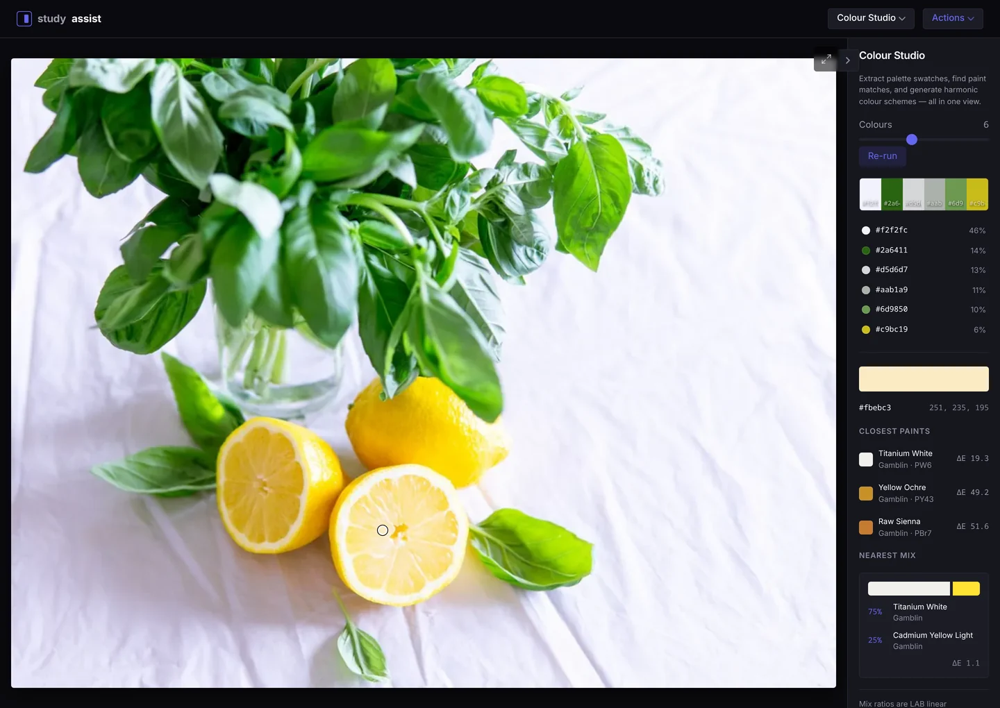
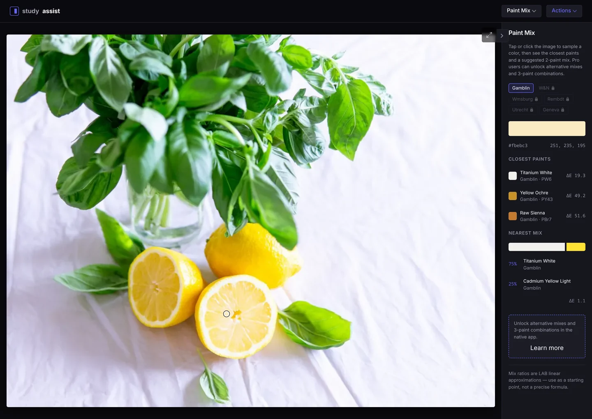
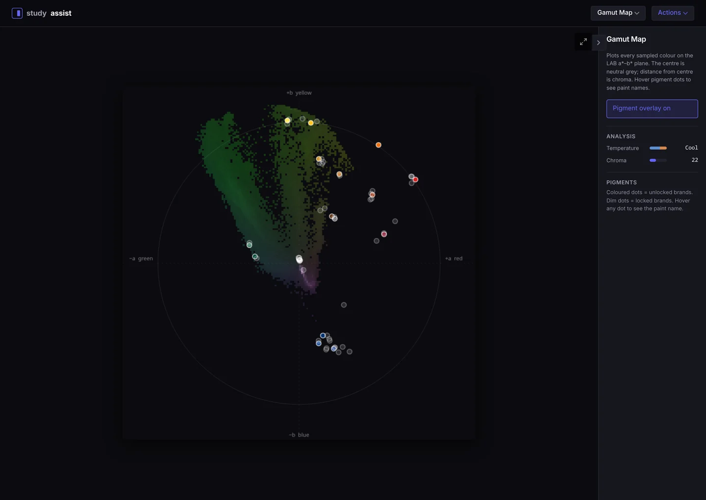
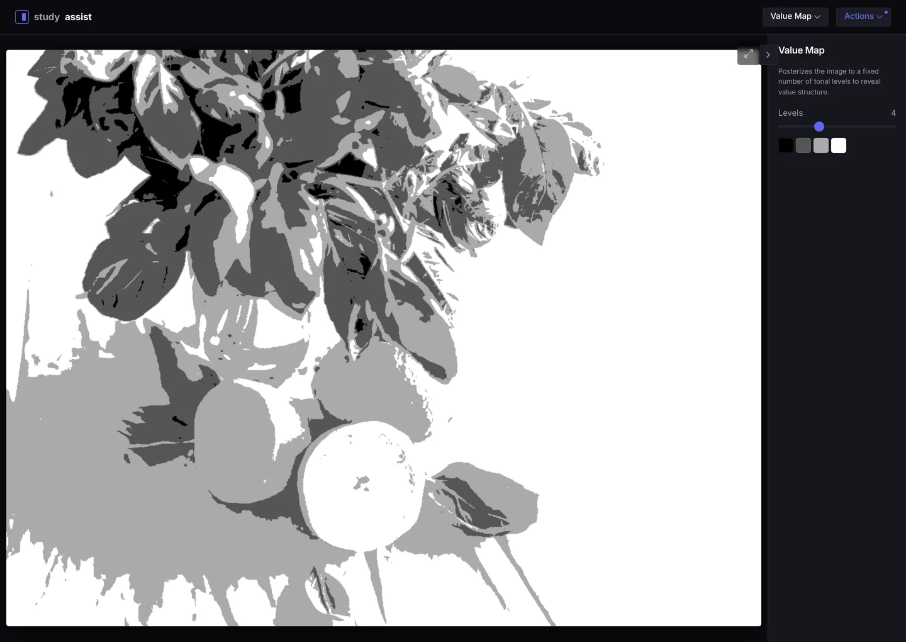
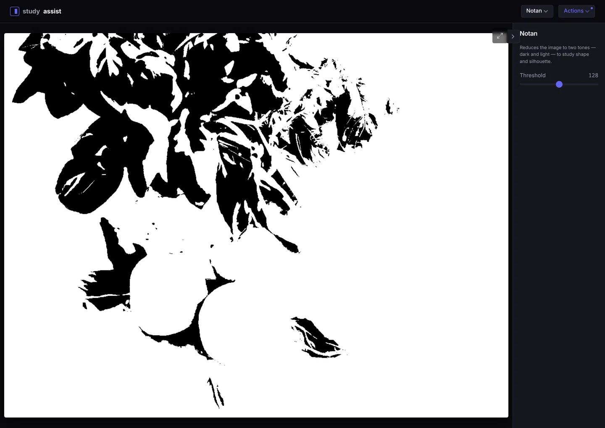
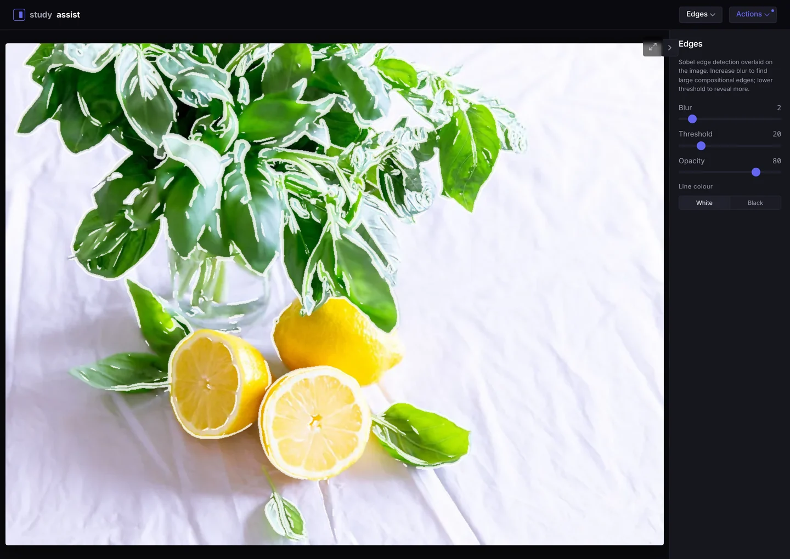
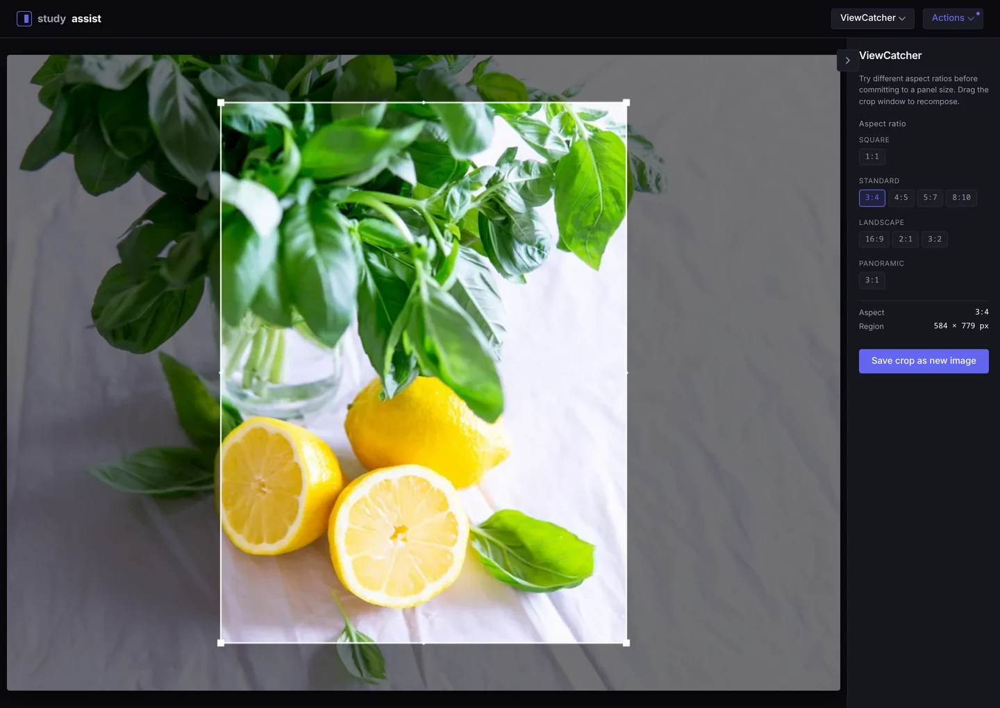
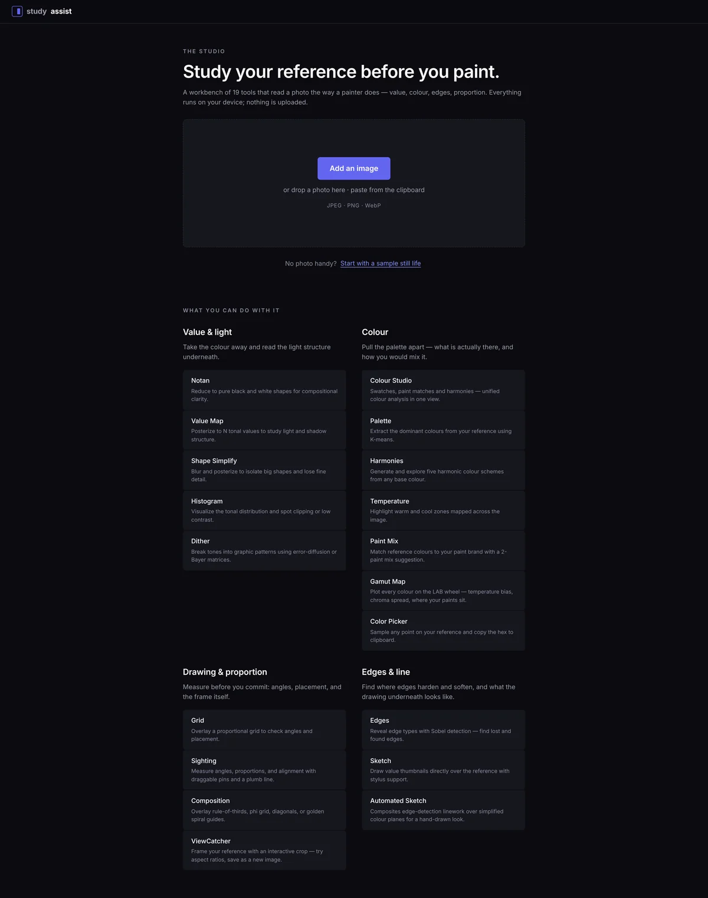

# study assist

> [!WARNING]
> **This repository will be made private soon.** Development is moving to a private repo ahead of the native app release. If you rely on the source, fork or clone it now — the hosted web app at [thephilip.github.io/study-assist](https://thephilip.github.io/study-assist/) stays up.

<p>
  
  
  
  
  
  
</p>

A painting reference tool for artists — value maps, notan, colour picking, paint mixing, dithering, and more in one place, with a clean dark-mode-first UI.



Process reference photos entirely in your browser. No uploads, no accounts, no server — everything runs locally on your device.

**→ Try it at [thephilip.github.io/study-assist](https://thephilip.github.io/study-assist/)**

---

## Screenshots

| | |
|---|---|
| **Paint Mix** — closest paints by LAB ΔE, plus a mix ratio<br> | **Gamut Map** — the image on the LAB a\*–b\* plane, with pigments overlaid<br> |
| **Value Map** — posterized to four tonal levels<br> | **Notan** — pure black and white on a threshold slider<br> |
| **Edges** — Sobel linework over the reference<br> | **ViewCatcher** — crop to a panel ratio before you commit<br> |

The landing page groups all 19 tools into four families — click any one to open it on a bundled sample photo:



---

## Tools

**Value & light** — take the colour away and read the light structure underneath.

| Tool | Description |
|---|---|
| **Notan** | Reduces to pure black and white to study shape and silhouette |
| **Value Map** | Posterizes to N tonal levels to reveal value structure |
| **Shape Simplify** | Box blur + posterize to flatten texture into readable flat shapes |
| **Histogram** | Luma histogram with log/linear scale; min, mean, and max tonal range stats |
| **Dither** | Floyd-Steinberg, Atkinson, Bayer 4×4/8×8 — greyscale and colour modes |

**Colour** — pull the palette apart: what is actually there, and how you would mix it.

| Tool | Description |
|---|---|
| **Colour Studio** | Unified colour analysis — palette swatches, paint matches, and harmonic schemes in one view |
| **Palette** | K-means++ colour clustering with a proportional swatch bar |
| **Harmonies** | Five HSL-based harmony schemes with optional pigment matching |
| **Temperature** | Maps hue to a warm/cool overlay while preserving luminance |
| **Paint Mix** | Matches sampled colours to your paint brand; suggests a 2-paint mix ratio (Pro unlocks alternative mixes and 3-paint combos) |
| **Gamut Map** | Plots every sampled colour on the LAB a\*–b\* plane — temperature bias, chroma spread, and where your specific paints fall |
| **Color Picker** | Hover to preview, click to lock; averages a sampled region; copies hex |

**Drawing & proportion** — measure before you commit: angles, placement, and the frame itself.

| Tool | Description |
|---|---|
| **Grid** | Configurable grid with presets, opacity, and line-colour controls |
| **Sighting** | Angle finder, proportion ratios, and plumb line for measuring your reference |
| **Composition** | Rule of thirds, phi grid, corner diagonals, golden spiral, centre crosshair |
| **ViewCatcher** | Interactive crop overlay with aspect ratio presets; drag to compose and save as the new working image |

**Edges & line** — find where edges harden and soften, and what the drawing underneath looks like.

| Tool | Description |
|---|---|
| **Edges** | Sobel edge overlay with blur, threshold, and opacity controls |
| **Sketch** | Draw value thumbnails directly over the reference, with pressure-sensitive stylus support |
| **Automated Sketch** | Composites Sobel edge linework over simplified colour planes for a hand-drawn sketch look |

---

## Working with an image

- **Getting a photo in** — drop a file, click **Add an image**, paste a screenshot from the clipboard, or start with the bundled sample still life.
- **Compare** — every processed-canvas tool has a side-by-side toggle against the original.
- **Save PNG** — export the processed canvas at full resolution.
- **Use as source** — bake a tool's output into the working image and carry on with the next tool. A full undo stack steps you back, and compare always shows the untouched original.
- **Zoom & pan** — pinch or scroll-wheel from 1× to 8×; double-tap to reset.
- **Full screen** — expand the canvas from any tool (native Fullscreen API, with a CSS fallback on iOS Safari).
- **Actions menu** — Mirror, Flip vertical, and Remove image, always available from the header. On touch devices it opens as a bottom sheet.
- **Controls panel** — collapse it out of the way entirely; the preference is remembered per tool.

---

## Paint brand database

Paint Mix, Colour Studio, Harmonies, and Gamut Map all read from the same pigment database, matched using LAB ΔE colour distance:

| Brand | Colours | Tier |
|---|---|---|
| Gamblin Artists' Oil | ~20 | Free |
| Winsor & Newton Artists' Oil | 9 | Premium |
| Williamsburg Handmade Oil | 6 | Premium |
| Rembrandt Artists' Oil | 9 | Premium |
| Utrecht Artists' Oil | 15 | Premium |
| Geneva Artists' Oil | 11 | Premium |

Hex values come from [artistpigments.org](https://artistpigments.org) spectrophotometer measurements where available and manufacturer swatch cards otherwise — treat them as D65 approximations, and mix ratios as a starting point rather than a formula.

Premium brand data is not part of this repository. Builds without it show grey placeholder dots in the Gamut Map; every other tool works unchanged.

---

## Install as an app (PWA)

Study Assist is installable on any device and works offline once installed — no app store, no account.

| Platform | How |
|---|---|
| **iPhone / iPad (Safari)** | Share button → **Add to Home Screen** → **Add** |
| **Android (Chrome)** | ⋮ menu → **Add to Home screen**, or tap the install banner |
| **Windows / Linux (Chrome, Edge, Brave)** | Install icon at the right of the address bar → **Install** |
| **macOS (Safari 17+)** | File → **Add to Dock** |
| **macOS (Chrome / Edge)** | Install icon in the address bar → **Install** |

Installed, it launches full-screen with its own icon, keeps working without a connection, and shows a reload prompt when a new version ships.

To install a **local** build rather than the hosted one, run `pnpm build && pnpm preview` and install from the preview URL. Service workers need `https://` or `localhost`, so a plain `http://` LAN address will not offer the install option.

---

## Getting started

```bash
pnpm install
pnpm dev
```

Open [http://localhost:5173](http://localhost:5173), drop in a reference photo, and start studying.

```bash
pnpm build      # production build → dist/
pnpm preview    # serve the build locally
pnpm typecheck  # tsc --noEmit
```

---

## Tech stack

- **Vite 8 + React 19 + TypeScript** (strict mode)
- **CSS Modules** + CSS custom properties — design tokens in `src/tokens/index.css`; all motion is CSS transitions and keyframes, no animation libraries
- **Canvas API** + `getImageData` pixel manipulation — no image processing libraries
- **Web Workers** for heavy algorithms (K-means palette extraction, gamut density analysis)
- **PWA** — installable, offline-capable, update notifications via service worker
- **No backend** — all processing is client-side; no data ever leaves the device

---

## Project structure

```
src/
  components/       # Panel, Slider, ImageDrop, CanvasWrap, ActionsMenu, ToolsMenu, Welcome, modals
  hooks/            # useImage (with undo stack), useProcessedCanvas
  lib/
    canvas.ts       # getPixelData, putPixelData, mapPixels, drawImageToCanvas
    color.ts        # RGB ↔ HSL ↔ LAB ↔ CMYK conversions + deltaE
    changelog.ts    # Versioned release notes (shown post-update)
    entitlements.ts # Brand pack unlock state (localStorage)
    pigments/       # Paint brand database + LAB nearest-neighbour matching
  tokens/
    index.css       # All design tokens (colour, type, spacing, radii, shadows, motion)
    animations.css  # Shared keyframes and animation utilities
  tools/            # One .ts (logic) + .tsx (component) per tool; index.ts is the registry
  workers/
    kmeans.worker.ts
    gamut.worker.ts
```

---

## Roadmap

- [ ] Native tablet app — iOS + Android (Flutter, post web release)
- [ ] Spectral-measured pigment data for improved mix accuracy

---

## License

MIT — see [LICENSE](LICENSE)
